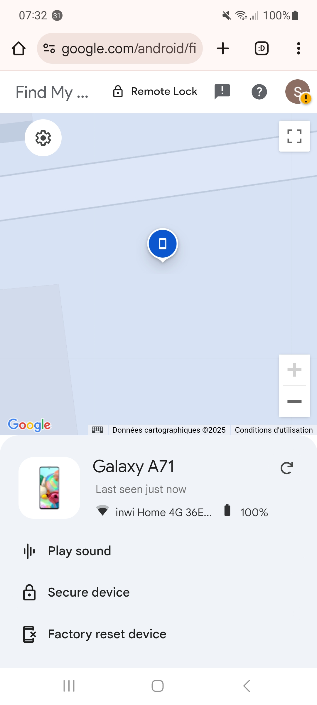
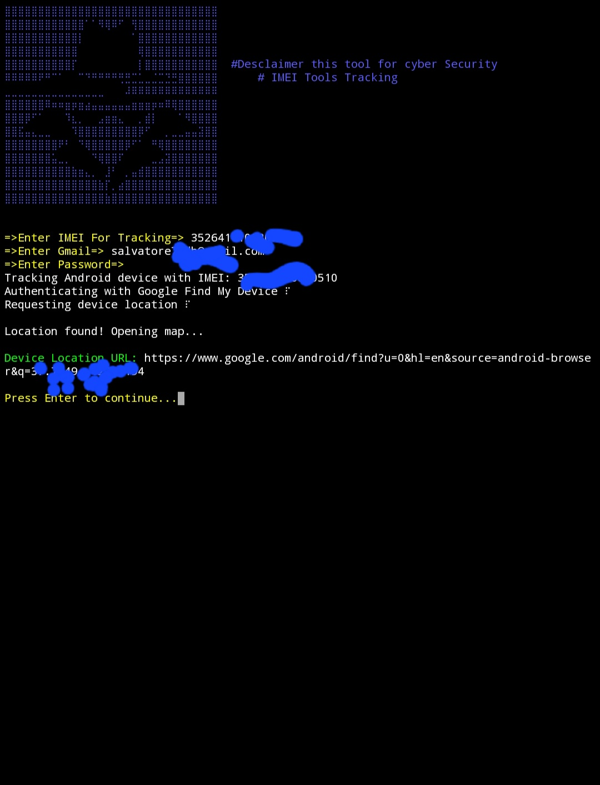

### About
This Tools for Cyber security Using Tracking IMEI && Apple ID 

- python

## Installation

1. Clone the repository:

    ```
    git clone https://github.com/Salvatore00cyber/IMEI-Track.git
    ```
## files
  ```
2. cd IMEI-Track
   ```
## Usage

1. Run the script:

    ```
    python3 Escanor-track.py
    ```

2. Follow the on-screen instructions to choose an option and provide necessary input.

## Example

Here's an example of how to use the script:
```
Example :
⣿⣿⣿⣿⣿⣿⣿⣿⣿⣿⣿⣿⣿⣿⣿⣿⣿⣿⣿⣿⣿⣿⣿⣿⣿⣿⣿⣿⣿⣿⣿⣿
⣿⣿⣿⣿⣿⣿⣿⣿⣿⣿⣿⣿⠁⠈⠻⢿⠿⠋⠀⢻⣿⣿⣿⣿⣿⣿⣿⣿⣿⣿⣿⣿
⣿⣿⣿⣿⣿⣿⣿⣿⣿⣿⣿⡇⠀⠀⠀⠀⠀⠀⠀⠈⣿⣿⣿⣿⣿⣿⣿⣿⣿⣿⣿⣿
⣿⣿⣿⣿⣿⣿⣿⣿⣿⣿⣿⠀⠀⠀⠀⠀⠀⠀⠀⠀⢿⣿⣿⣿⣿⣿⣿⣿⣿⣿⣿⣿
⣿⣿⣿⣿⣿⣿⣿⣿⣿⣿⡏⠀⠀⠀⠀⠀⠀⠀⠀⠀⢸⣿⣿⣿⣿⣿⣿⣿⣿⣿⣿⣿  #Desclaimer this tool for cyber Security
⠿⠿⠿⠿⠿⠟⠛⠉⠁⠀⠀⠉⠙⠛⠛⠛⠛⢛⣛⣉⣁⣀⣈⣉⣙⣛⣿⣿⣿⣿⣿⣿      # IMEI Tools Tracking
⣀⣀⣀⣀⣀⣀⣀⣀⣀⣀⣀⣀⣀⣀⣀⠀⠀⠀⠼⠿⠿⠿⠿⠿⠿⠿⠿⠿⠿⠿⠿⠿
⣿⣿⣿⣿⣿⣿⠿⠶⠶⣶⡶⣶⣴⣤⣤⣤⣤⣤⣤⣶⣶⣶⡶⠶⠿⢿⣿⣿⣿⣿⣿⣿
⣿⣿⣿⡿⠋⠁⠀⠀⠀⠹⣆⡀⠀⠀⣠⣶⣶⣄⠀⠀⢀⣾⡇⠀⠀⠀⠈⠻⣿⣿⣿⣿
⣿⣿⣯⣤⣄⣀⣀⠀⠀⠀⠹⣿⣿⣿⣿⣿⣿⣿⣿⣿⡿⠋⠀⠀⢀⣀⣀⣤⣤⣽⣿⣿
⣿⣿⣿⣿⣿⣿⣿⣿⠟⠃⠀⠙⢿⣿⣿⣿⣿⣿⡿⠋⠁⠀⠛⢿⣿⣿⣿⣿⣿⣿⣿⣿
⣿⣿⣿⣿⣿⣿⣿⣥⣀⡀⠀⠀⠀⠙⢿⣿⣿⠏⠀⠀⠀⠀⣀⣠⣽⣿⣿⣿⣿⣿⣿⣿
⣿⣿⣿⣿⣿⣿⣿⣿⣿⣿⣷⣶⣄⡀⠀⣸⠃⠀⢀⣤⣾⣿⣿⣿⣿⣿⣿⣿⣿⣿⣿⣿
⣿⣿⣿⣿⣿⣿⣿⣿⣿⣿⣿⣿⣿⣿⣷⡏⢀⣴⣿⣿⣿⣿⣿⣿⣿⣿⣿⣿⣿⣿⣿⣿
⣿⣿⣿⣿⣿⣿⣿⣿⣿⣿⣿⣿⣿⣿⣿⣷⣿⣿⣿⣿⣿⣿⣿⣿⣿⣿⣿⣿⣿⣿⣿⣿

=>set Device Name<=
1. =>Android
2. =>iPhone
3. =>Exit

=>Enter your choice (1-3):
```

##Demo 

##Tracking Device 

## Social account 

```
https://www.instagram.com/6ec_0

```
---
